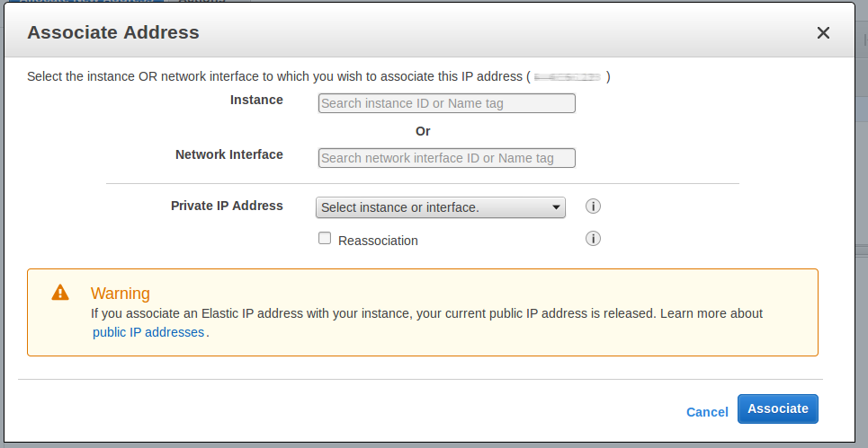
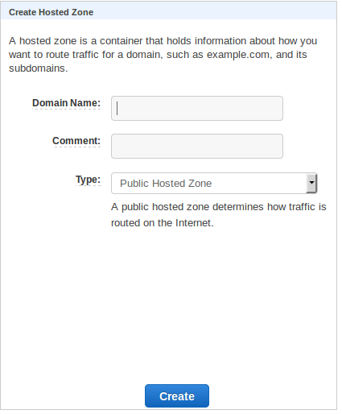
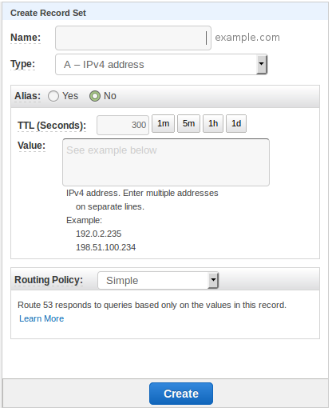

# How to Link Your Domain to your Amazon EC2 project

[TOC]

## (Optional) Create an elastic IP address for your ec2 server
By setting up an elastic IP address, you can have an IP address for your 
Amazon EC2 project that will never change. You can even reassign that same IP 
address to a different EC2 instance if you like. 

Go to your EC2 Dash board, and in the network and Security section, click on 
**Elastic IPs**. 

Click on the **Create a new Address** button at the top. This will create a new 
elastic IP for you. 

Copy and paste the IP address into a test editor, as we will be using the IP 
address later. 

Now click on the **Actions** button, and in the dropdown menu that appears, 
click on **Associate Address** and you will get a popup that looks like this: 

- **Instance**: select the EC2 instance you want to use. Then click **Associate**

## Get the Public IP of your EC2 Instance
If you followed the last step to create an elastic IP and have already copied 
the IP address, then you can skip this section. 

In your Amazon AWS dashboard, go into **Instances**, and select the EC2 instance 
you want to have your domain name point to. You will see a panel at the bottom. 
In the **Description** tab, search for the field that says **Public IP**. Copy 
and paste this IP address into a test editor as we will need it later. 

## Prepare Amazon AWS to route traffic from your domain

Go to the Amazon Route 53 dashboard by either: 

- Clicking on **services** then selecting **Route 53**. 
- or using thus url [https://console.aws.amazon.com/route53/]( https://console.aws.amazon.com/route53/)   

From the Route 53 dashboard, go into DNS management. Now click on 
**Create Hosted Zone**. 

A hosted zone will contain information about how the trafic will be routed to 
your sever from yur domain. 

If you see a form that asks you to enter the Domain Name, then enter your 
domain name eg" `example.com`. Otherwise, there should be a button that says 
**Create Hosted Zone**, click on this and the form should appear. 

Once you have entered the domain name, click on the **Create** button. 

This will take you to the **Create Record Set** section. This is where we will 
create the settings to route the trafic to our AWS servers.  

This opens up a new form to edit which looks something like this: 

- **Name**: Leave the name blank (unless you want to use a subdomain). 
- **Type**: choose A — IPv4 address.
- **Alias**: Choose no 
- **Value**: Paste the Public IP (or Elastic IP) address you copied into the 
             text editor previously.
- **Routing Policy**: Simple

Now click the **Create** button. 

You should now have three entries in the **Record Set** section. Type **A**, 
**NS**, and **SOA**. Now look at the entry for type NS. It should have several 
addresses for its value. Copy and paste any two of those addresses into a text 
editor, as we will be using it in the next step. 

