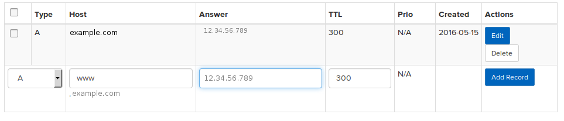

# How to Link Your Registered Domain Name to your Amazon EC2 project

So you have built a funky web application. You are running it on an Amazon EC2 
instance. And you have registered a memorable domain name for people to access 
your website with. So.... now what?

If you feel completely lost about how to get your domain name to point to your 
EC2 instance, then you are not alone. This was confusing and painful 
journey when I first tried it. But hopefully I can make it much less painful 
for you. 

In order to have your domain name route traffic to your EC2 instance, we need to 
associate the domain name you registered to the IP address of your EC2 instance. 
We do this by entering these details in a Domain Name System (DNS). This is 
like a phonebook for the internet. When someone types www.example.com on their 
browser, it looks up that name in a DNS server, which returns an IP address. 
That IP address then tells your browser where to locate the content you are 
looking for. 


## 0. (Optional) Create an elastic IP address for your ec2 server
By setting up an elastic IP address, you can have an IP address for your 
Amazon EC2 project that will never change. You can even reassign that same IP 
address to a different EC2 instance if you like. 

Note that by setting up an elastic IP address, the IP address of your EC2 
instance will be changed. So if you had security settings that restricted the 
IP address from which you could serve your application from, then you will need 
to update those settings after you create an elastic IP. 

Ok, go to your EC2 Dash board, and in the network and Security section, click on 
**Elastic IPs**. 

Click on the **Create a new Address** button at the top. This will create a new 
elastic IP for you. 

Copy and paste the IP address into a test editor, as we will be using the IP 
address later. 

Now click on the **Actions** button, and in the dropdown menu that appears, 
click on **Associate Address** and you will get a popup that looks like this: 


- **Instance**: select the EC2 instance you want to use. Then click **Associate**


## 1. Get the Public IP of your EC2 Instance
If you followed the last step to create an elastic IP and have already copied 
the IP address, then you can skip this section. 

In your Amazon AWS dashboard, go into **Instances**, and select the EC2 instance 
you want to have your domain name point to. You will see a panel at the bottom. 
In the **Description** tab, search for the field that says **Public IP**. Copy 
and paste this IP address into a test editor as we will need it later. 


## 2. The Easy Way to set DNS settings

This is the quick and easy way I wish was available to me the first time I 
tried to link to an Amazon EC2 instance. Most Domain Name Registration services 
will have their own service to update the DNS records, and will allow you to 
update the details for your domain name. 

Log into the website that you registered your domain name from. There should be 
a section dedicated to DNS settings. Go to that section. If there is the option 
to either modify, or add a DNS field labelled **Type A**, then you are in luck! 
You will be up an running in a few more minutes, and can continue reading this section of the tutorial. However, if the only fields it allows you to edit are 
ones of type **NS** (eg NS1, and NS2), then it will involve a bit more work 
(and a potentially long waiting period). If this is the situation you are in, 
then you will need to skip this section of the tutorial and go to the next one.

Ok, so if you are still reading, then I am assuming you have the option to edit 
or add a DNS field of type **A**. When editing this record, there should be 
several sub-fields to edit: 

- **Host**: This should be set to your plain domain `example.com` (If you are  
            with godaddy you will need to have `@.example.com`)
- **Answer** or **Points to** or **Value**: here you paste the IP address of 
            your EC2 instance. 
- **TTL**: This controls how often (in seconds) a DNS server (or your browser) 
           is allowed to cache this record for before refreshing. You can leave 
           this to whatever the default is. Or if there is no default, then 
           enter your own (the values 300 and 600 are quite common). 

Below is an example of what the edit screen for field of type **A** might look
like. 



Once you update that field, you will create yet another one of type **A** if 
you want people to access your website using the `www` prefix (eg
`www.example.com`). Note that if it does not allow you to add another one of 
type **A** (as is the case with Godaddy), then you will need to add/edit one of 
type **CNAME**. The subfields should be the same, but this time adding `www` to 
the hostname so it looks like `www.example.com`. Again, add the IP address to 
your EC2 instance in the relevant field (if you are using Godaddy, you will 
need to use `@` instead)

Once you have saved those changes, you are done! Thats it! There is no need for 
you to continue with any of the other sections of this tutorial. All you have 
to do is wait a little bit for the cached entries in DNS servers to refresh. 

You can monitor if the changes have occured using the command line tool `dig` 
(which should be installed by default on an ubuntu machine). Type: 

```
dig example.com
```

And if you spot the IP address of your EC2 instance on there, then you know it 
is ready to route traffic to your site :) 


## 3. Prepare Amazon AWS to route traffic from your domain

Go to the Amazon Route 53 dashboard by either: 

- Clicking on **services** then selecting **Route 53**. 
- or using thus url [https://console.aws.amazon.com/route53/]( https://console.aws.amazon.com/route53/)   

From the Route 53 dashboard, go into DNS management. Now click on 
**Create Hosted Zone**. 

A hosted zone will contain information about how the trafic will be routed to 
your sever from yur domain. 

If you see a form that asks you to enter the Domain Name, then enter your 
domain name eg" `example.com`. Otherwise, there should be a button that says 
**Create Hosted Zone**, click on this and the form should appear. 


Once you have entered the domain name, click on the **Create** button. 

This will take you to the **Create Record Set** section. This is where we will 
create the settings to route the trafic to our AWS servers.  

This opens up a new form to edit which looks something like this: 


- **Name**: Leave the name blank (unless you want to use a subdomain). 
- **Type**: choose A — IPv4 address.
- **Alias**: Choose no 
- **Value**: Paste the Public IP (or Elastic IP) address you copied into the 
             text editor previously.
- **Routing Policy**: Simple

Now click the **Create** button. 

Now click on **Create Record Set** again. We will create a new record and fill 
things out exactly the same as before except for: 

- **Name**: this time type in `wwww` 

You should now have several entries in the **Record Set** section. At least two 
for Type **A**, one for **NS**, and one for **SOA**. Now look at the entry for 
type NS. It should have several addresses for its **value** section. Copy and 
paste those addresses into a text editor, as we will be using it in the next 
step. 


## 4. Change DNS settings in your Domain Name Provider
Log into the website where you registered your domain name. Ther should be a 
section to change your **DNS** settings. Look for a section that contains the 
**nameservers**. It should have two or more fields that look something like this: 

```sh
ns1.example.com
ns2.example.com
```

The numbers and domain name will differ, but it will usually always begin with 
**ns**. We will be changing these, so click whatever is needed to edit the 
contents of these fields. Delete whatever values were already in there. Now we 
will replace each of them with the addressed we got from Amazon S5. Please note 
the following things: 

- If your domain name register has less entries than the number of addresses 
  you got from Amazon, then just select any of the addresses you like, there 
  is no need to use all of them. 
- If the addresses we copied from Amazon S5 contained a full-stop at the very 
  end, then delete that full-stop when entering it into these fields (but do not 
  delete them from Amazon S5).

Once you have edited and saved these changes, it is just a matter of waiting. 
It might take several hours (or even a few days) for these changes to take 
effect. 

You monitor if the changes have occured using the command line tool `dig` 
(which should be installed by default on an ubuntu machine). Type: 

```
dig example.com
```

And if you see the new NS addresses that you entered, then it is ready. 
Otherwise keep waiting. 

When it is ready, you can access your EC2 server using you new domain name :) 

Hope this tutorial was helpful. 


